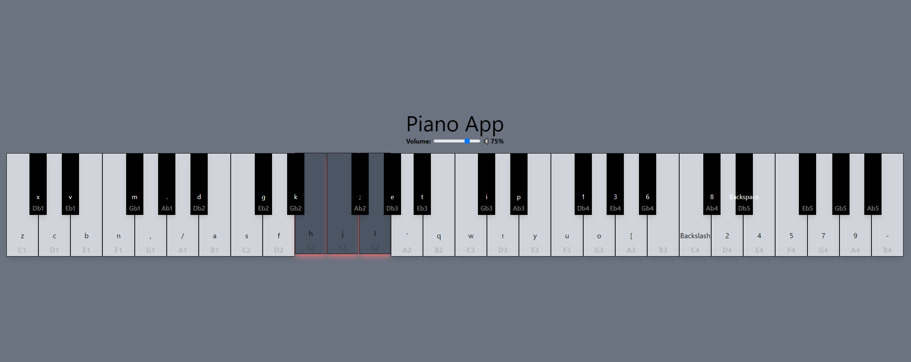

# Piano App Project

## Overview

This project is a simple piano app built using React and Tailwind CSS. The app allows users to play piano keys and adjust the volume.

## Files

- [piano-app/src/Piano.js]This file contains the Piano component, which renders the piano keys and handles user input.
- [piano-app/src/App.js]This file contains the App component, which renders the Piano component and handles app-wide state.
- [piano-app/tailwind.config.js]This file contains the Tailwind CSS configuration for the project.

## Screen Shot



## Code Snippets

### Piano.js

```jsx
import React, { useState, useEffect } from "react";
import VolumeSlider from "./VolumeSlider";

const whiteKeys = [
	// ...
];

const blackKeys = [
	// ...
];

const Piano = () => {
	const [activeKeys, setActiveKeys] = useState([]);
	const [volume, setVolume] = useState(50);

	const playSound = key => {
		console.log(`Playing sound for key: ${key}`);

		if (key === activeKeys[activeKeys.length - 1]) {
			console.log(`Key ${key} is already active.`);
			return;
		} else {
			const audio = new Audio(`/sounds/${key}.mp3`);
			audio.volume = volume / 100;
			audio.play().catch(error => {
				console.error(`Error playing sound for key ${key}:`, error);
			});
		}
	};

	return (
		<div>
			<VolumeSlider volume={volume} setVolume={setVolume} />
			{/* ... */}
		</div>
	);
};

export default Piano;
```

### App.js

```jsx
import React from "react";
import Piano from "./Piano";

const App = () => {
	return (
		<div>
			<Piano />
		</div>
	);
};

export default App;
```

### Tailwind config

```js
module.exports = {
	content: ["./src/**/*.{js,jsx,ts,tsx}"],
	theme: {
		extend: {},
	},
	plugins: [],
};
```

## Running the Code

### To run the code, follow these steps:

1. Install dependencies: Run the following command in your terminal:

```bash
npm install
```

2. Start the development server: Run the following command in your terminal:

```bash
npm run start
```

3. Open the app in your browser: Open your web browser and navigate to http://localhost:3000.

## Building the App

To build the app for production, run the following command in your terminal:

```bash
npm run build
```

This will create a production-ready build of the app in the build directory.
